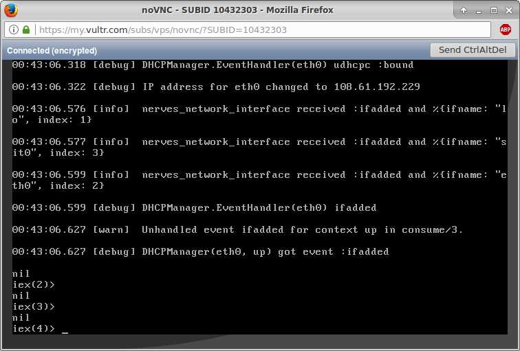

# vultr_example

*After writing this up, I saw a few easy things to fix in the
[nerves_system_vultr](https://github.com/fhunleth/nerves_system_vultr)
dependency. This could cause errors. If you're really interested in replicating
this experiment, ping me on the #nerves slack channel.*

This is a demo of using Nerves to deploy a Phoenix application to the cloud.
It should be viewed as an experiment in response to several people asking me
whether it was possible. I've only taken the initial steps.  This example uses
the [Vultr](https://vultr.com) VPS provider since it was easiest for me to find
information on it.

Some highlights:

1. The Nerves tooling handles cross-compiling for the target server. If
   you're on OSX, you've probably run into this issue during deployment.
2. Nerves uses Distillery to make an OTP release and then takes the release
   and bundles a minimal Linux setup with it.
3. Everything required to run the server is packed into a special zip file
   (called a firmware bundle in Nerves) which is about 20 MB for the default
   Phoenix application. This probably can be reduced.
4. The Phoenix example's root entire filesystem was 23 MB (this is read-only
   in Nerves so it can be packed tightly), and it used about 165 MB of DRAM as
   reported by the `free` utility.
5. Start time was in the low seconds. It might be faster - I need to try
   harder to capture it rather than eyeballing the Vultr console utility.
6. Updating a server took a little over 20 seconds to transfer the complete image from
   my home WiFi over ssh, apply it, and reboot.

Work that's needed includes at least:

1. Improve the server bootstrap process. Getting the very first image on is
   currently tedious and probably Vultr-specific (uses iPXE).
2. The terminology used in Nerves feels completely foreign for backend use.
   (i.e. deploying "firmware" to servers sounds more like updating the BIOS)
3. Support provisioning of the server via environment variables or any other
   typical mechanisms.
4. Target Amazon EC2 and other providers/server technologies. I don't know why
   this couldn't be done as well.
5. Cleanup and documentation. If this turns out to be interesting, it's going
   to need a good pass to make the whole approach accessible to newcomers and
   obvious to experienced devs that they aren't losing functionality.

## Overview

If you're familiar with Nerves, targeting a Vultr VPS will feel familiar.
This project targets a specific cross-compiler and system. The system
contains the Linux kernel, Erlang, and a few other libraries and applications
needed to run the non-Elixir parts of your program. The cross-compiler
targets x86_64 and the small Musl C library. In theory, there's a cross-compiler
for any platform that you could use, but if you're trying this out, there might
just be one for Linux and OSX.

Nerves projects output what's called a firmware bundle. This is a zip file
with the `.fw` extension that contains everything that goes on the server.
It's used for the initial bootstrap of the server and for updates. The size
is usually in the low 10s of MB depending on the complexity of your application.
Think of this as an OTP release plus a minimal Linux installation. It is on
the Nerves roadmap to more tightly integrate this with Distillery.

Bootstrapping a Nerves device usually involves programming (also called burning)
a MicroSD card or using some other mechanism for programming on device
Flash memory. Obviously, this won't work on a cloud server. Vultr supports iPXE
scripts so that's what's used to download a loader application that programs
the first `.fw` file onto the server's SSD. This is fast since the downloads
are small. After writing the server's SSD, the loader application reboots and
runs the Phoenix application.

Nerves devices have a very small Linux environment and this can be trimmed
down further to reduce image size, minimize attack surface, etc. The root
filesystem is stored as a SquashFS image. As opposed to ext4 and other
filesystems that you may normally use on a server, SquashFS is read-only
and compressed. For physical Nerves devices, all application data is stored on
a separate ext4 formated partition. I'm unclear whether this is necessary
for cloud Nerves devices since it seems to a database can be assumed to be
available in any real world deployment. However, if a database were to
be run co-located with the Phoenix application, it could be stored there.

Software updates involve pushing a new `.fw` file using a special `ssh`
subsystem (similar to what's supported for SFTP). Normal `ssh` console
access is not enabled in the example, but it could be. Vultr provides console
access for debugging images, so this didn't seem necessary. More information
about how updates work can be found at [nerves_firmware_ssh](https://github.com/fhunleth/nerves_firmware_ssh).
This mechanism can be used by tools like Ansible to update many devices
at a time.

## Building this project

This project is set up as a Phoenix app placed side-by-side with a Nerves
application that references it as a path dependency. This could be made
into an umbrella app, but umbrellas have caused some confusion in the
Nerves community so I've left it out.

Before you build, go to `nerves_app/config/config.exs` and look at how
the `ssh` authorized keys are configured. Update this to hold whatever
public keys that you want for updating the software. See `nerves_firmware_ssh`
for more details.

Now go to the `nerves_app` directory and run this:
```
$ export MIX_TARGET=vultr
$ mix deps.get
$ mix firmware
```

You should have a `.fw` file. You'll need this for bootstrapping the server.
Run `find . -name "*.fw"` to get the path. We have `mix` tasks for common
tasks involving this file, but they're not applicable here.

## Bootstrapping a Vultr VPS

This part is currently pretty hard. The loader application source code
can be found at [fhunleth-buildroot-experiments](https://github.com/fhunleth/fhunleth-buildroot-experiments).
The easiest thing is probably to reuse the loader app that I created rather
that try to rebuild it.

Upload your `.fw` file from the previous step to a web server.

Next, create an iPXE script and load it onto a web server. Here are the contents
of mine:

```
# Download the loader's Linux kernel
kernel https://s3.amazonaws.com/files.troodon-software.com/vultr/bzImage

# Download the loader's root filesystem
initrd https://s3.amazonaws.com/files.troodon-software.com/vultr/rootfs.cpio.xz

# Download the Nerves .fw file into the root filesystem
# IMPORTANT: Update this to your .fw file
initrd https://s3.amazonaws.com/files.troodon-software.com/vultr/nerves_system_vultr.fw /root/install.fw

# Boot!!
boot
```

Now go the the Vultr website to setup a new server. Pick the cheapest
server possible. No matter what you pick, it will be complete overkill
for this. Select "Upload ISO" for the server type and click iPXE.
Set the "iPXE Chain URL" to the URL for your script.

Start the server. If you click on the show console button, you may see
the loader run. You should eventually get an `iex>` prompt:



## Updating a running instance

Make some changes to the Phoenix app and rebuild by running:

```
$ export MIX_TARGET=vultr
$ mix firmware
```

If your `ssh` key is not password protected, you should be able to
run `mix firmware.push <ip address>`. If your key is password-protected
like mine, you'll prefer to run OpenSSH `ssh` so that it can prompt
you for the key. There's a shell script in the `nerves_firmware_ssh`
project called `upload.sh`. Download it and run it as `./upload.sh <ip address>`

You should see a progress as the upload occurs. At the end, it will reboot
the server. This takes about 20 seconds on my home WiFi and I've wondered if
something is limiting the upload bandwidth to 1 MB/sec. It seems like it should
be faster.

## Notes

This setup pulls in the `nerves_init_gadget` project as a convenience for
setting up networking. This has several unnecessary dependencies and wouldn't
be used on a real deployment.

Also, everything runs as `root` which will certainly trigger some alarm bells.
Suffice it to say that this can be changed with not too much work. The software
update program, `fwup` will need root permissions to update the SSD and the
networking code needs root permissions to configure `eth0`. `erlinit` has an
option to drop priviledges before starting the Erlang VM.
